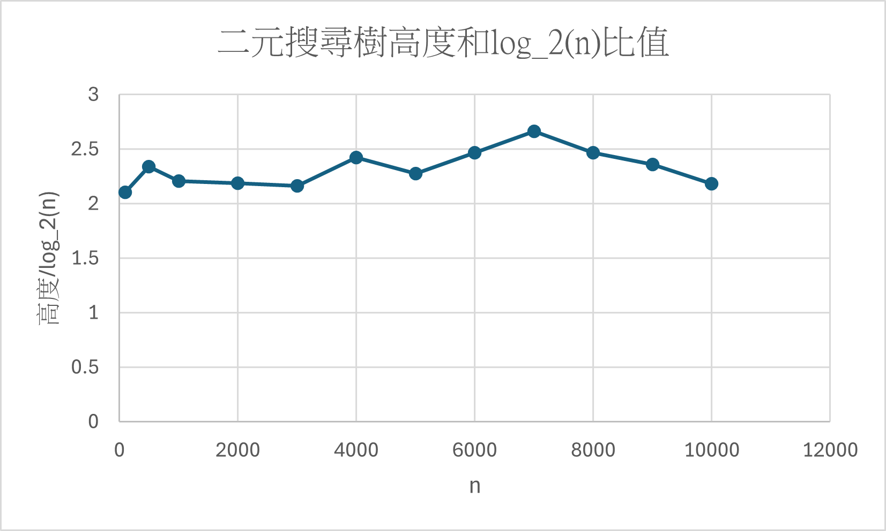

# 41343134曾偉哲 41343143詹竣翔
## 作業二 Graph
## 解題說明
 本作業目標為透過程式實作與操作，理解圖（Graph）在資料結構中的表示方式與常用演算法   
- 圖的表示方式(ADT):

  Adjacency List（鄰接串列）、Adjacency Matrix（鄰接矩陣）
 
- 圖的走訪（DFS、BFS）

  DFS（Depth First Search）：深度優先搜尋，使用遞迴或 stack。

  BFS（Breadth First Search）：廣度優先搜尋，使用 queue。

- 連通元件（Connected Components）

  對每個未被訪問的頂點進行 DFS，DFS 被啟動的次數即為連通元件數量。

- 最小生成樹（Minimum Spanning Tree）
 
  Kruskal 演算法：將邊依權重排序，利用 DSU（Union-Find）避免形成 cycle。

- 最短路徑（Shortest Path）

  Dijkstra 演算法：用 priority queue 每次取出目前距離最小的點進行鬆弛（relax），適用於非負權重圖。


### 解題策略


   
## 程式實作
### IDE:
Microsoft Visual Studio Code C/C++


```cpp
#include <iostream>
#include <vector>
#include <queue>
#include <algorithm>
#include <list>
#include <climits>

using namespace std;

// Disjoint Set (Union-Find) 用於 Kruskal's Algorithm
class DisjointSet {
	vector<int> parent, rank;
public:
	DisjointSet(int n) {
		parent.resize(n);
		rank.resize(n, 0);
		for(int i = 0; i < n; ++i) parent[i] = i;
	}
	int find(int i) {
		if(parent[i] == i) return i;
		return parent[i] = find(parent[i]); // 路徑壓縮
	}
	void unionSets(int i, int j) {
		int root_i = find(i);
		int root_j = find(j);
		if(root_i != root_j) {
			// 按秩合併 (Union by Rank)
			if(rank[root_i] < rank[root_j]) {
				parent[root_i] = root_j;
			} else if(rank[root_i] > rank[root_j]) {
				parent[root_j] = root_i;
			} else {
				parent[root_j] = root_i;
				rank[root_i]++;
			}
		}
	}
};

// 圖的抽象資料型態 (Graph ADT)
class Graph {
protected:
	int numVertices;
public:
	Graph(int v) : numVertices(v) {}
	virtual ~Graph() = default;

	// 定義基本操作介面
	virtual void insertEdge(int u, int v) = 0;
	virtual void display() = 0;
};

// 無權重圖 (LinkedGraph) - 使用鄰接串列 (Adjacency List)
class LinkedGraph : public Graph {
	vector<vector<int>> adjList;

	void dfsUtil(int v, vector<bool>& visited) {
		visited[v] = true;
		cout << v << " ";
		for(int neighbor : adjList[v]) {
			if(!visited[neighbor]) {
				dfsUtil(neighbor, visited);
			}
		}
	}

public:
	LinkedGraph(int v) : Graph(v) {
		adjList.resize(v);
	}

	void insertEdge(int u, int v) override {
		adjList[u].push_back(v);
		adjList[v].push_back(u); // 無向圖
	}

	void display() override {
		for(int i = 0; i < numVertices; ++i) {
			cout << i << ": ";
			for(int neighbor : adjList[i]) {
				cout << neighbor << " ";
			}
			cout << endl;
		}
	}

	void DFS(int startVertex) {
		vector<bool> visited(numVertices, false);
		cout << "DFS: ";
		dfsUtil(startVertex, visited);
		cout << endl;
	}

	void BFS(int startVertex) {
		vector<bool> visited(numVertices, false);
		queue<int> q;

		visited[startVertex] = true;
		q.push(startVertex);

		cout << "BFS: ";
		while(!q.empty()) {
			int v = q.front();
			q.pop();
			cout << v << " ";

			for(int neighbor : adjList[v]) {
				if(!visited[neighbor]) {
					visited[neighbor] = true;
					q.push(neighbor);
				}
			}
		}
		cout << endl;
	}

	void ConnectedComponents() {
		vector<bool> visited(numVertices, false);
		int count = 0;
		for(int i = 0; i < numVertices; ++i) {
			if(!visited[i]) {
				cout << "Component " << ++count << ": ";
				dfsUtil(i, visited);
				cout << endl; // 換行，每個連通元件一行
			}
		}
	}
};

// 加權無向圖 (WeightedGraph)
class WeightedGraph : public Graph {
	// 儲存 (neighbor, weight)
	vector<vector<pair<int, int>>> adjList;

	struct Edge {
		int u, v, weight;
	};

	vector<Edge> edges; // 用於 Kruskal's 演算法排序邊

public:
	WeightedGraph(int v) : Graph(v) {
		adjList.resize(v);
	}

	void insertEdge(int u, int v, int weight) {
		adjList[u].push_back({v, weight});
		adjList[v].push_back({u, weight});
		edges.push_back({u, v, weight});
	}

	// 實作抽象類別方法
	void insertEdge(int u, int v) override {
		insertEdge(u, v, 1);
	}

	void display() override {
		for(int i = 0; i < numVertices; ++i) {
			cout << i << ": ";
			for(auto& edge : adjList[i]) {
				cout << "(" << edge.first << ", w:" << edge.second << ") ";
			}
			cout << endl;
		}
	}

	// Prim's 最小生成樹 (MST)
	void Prim(int startVertex) {
		// min-priority queue 儲存 (weight, vertex)
		priority_queue<pair<int, int>, vector<pair<int, int>>, greater<pair<int, int>>> pq;
		vector<int> key(numVertices, INT_MAX);
		vector<int> parent(numVertices, -1);
		vector<bool> inMST(numVertices, false);

		pq.push({0, startVertex});
		key[startVertex] = 0;

		while(!pq.empty()) {
			int u = pq.top().second;
			int weight_u = pq.top().first; // 取得當前的路徑長
			pq.pop();

			if(inMST[u]) continue;
			// 由於只對未加入 MST 的頂點更新
			inMST[u] = true;

			for(auto& edge : adjList[u]) {
				int v = edge.first;
				int weight = edge.second;

				if(!inMST[v] && key[v] > weight) {
					key[v] = weight;
					pq.push({key[v], v});
					parent[v] = u;
				}
			}
		}

		cout << "Prim's MST:\n";
		long long totalWeight = 0;
		for(int i = 0; i < numVertices; ++i) {
			if(parent[i] != -1) {
				cout << parent[i] << " - " << i << " : " << key[i] << "\n";
				totalWeight += key[i];
			}
		}
		cout << "Total Weight: " << totalWeight << endl;
	}

	// Kruskal's 最小生成樹 (MST)
	void Kruskal() {
		vector<Edge> sortedEdges = edges;
		sort(sortedEdges.begin(), sortedEdges.end(), [](const Edge& a, const Edge& b){
			return a.weight < b.weight;
		});

		DisjointSet ds(numVertices);
		vector<Edge> mst;
		long long mstWeight = 0;

		for(auto& edge : sortedEdges) {
			if(ds.find(edge.u) != ds.find(edge.v)) {
				ds.unionSets(edge.u, edge.v);
				mst.push_back(edge);
				mstWeight += edge.weight;
			}
		}

		cout << "Kruskal's MST:\n";
		for(auto& edge : mst) {
			cout << edge.u << " - " << edge.v << " : " << edge.weight << "\n";
		}
		cout << "Total Weight: " << mstWeight << endl;
	}

	// Dijkstra's 單源最短路徑
	void Dijkstra(int src) {
		priority_queue<pair<int, int>, vector<pair<int, int>>, greater<pair<int, int>>> pq;
		vector<int> dist(numVertices, INT_MAX);

		pq.push({0, src});
		dist[src] = 0;

		while(!pq.empty()) {
			int u = pq.top().second;
			int d = pq.top().first;
			pq.pop();

			// 如果取出的距離大於已記錄的最小距離，則忽略
			if (d > dist[u]) continue;

			for(auto& edge : adjList[u]) {
				int v = edge.first;
				int weight = edge.second;

				if(dist[v] > dist[u] + weight) {
					dist[v] = dist[u] + weight;
					pq.push({dist[v], v});
				}
			}
		}

		cout << "Dijkstra's Shortest Paths from " << src << ":\n";
		for(int i = 0; i < numVertices; ++i) {
			cout << "To " << i << " : ";
			if (dist[i] == INT_MAX) cout << "Infinity\n";
			else cout << dist[i] << "\n";
		}
	}
};

int main() {
	cout << "=== LinkedGraph (無權重圖) ===\n";
	LinkedGraph lg(5);
	lg.insertEdge(0, 1);
	lg.insertEdge(0, 2);
	lg.insertEdge(1, 3);
	//lg.insertEdge(2, 4);
	lg.insertEdge(3, 4);
	// 故意將頂點 5 設為孤立點以測試連通元件

	lg.display();
	lg.DFS(0);
	lg.BFS(0);
	lg.ConnectedComponents();

	cout << "\n=== WeightedGraph (加權無向圖) ===\n";
	WeightedGraph wg(4);
	wg.insertEdge(0, 1, 10);
	wg.insertEdge(0, 2, 6);
	wg.insertEdge(0, 3, 5);
	wg.insertEdge(1, 3, 15);
	wg.insertEdge(2, 3, 4);
	/*wg.insertEdge(0, 1, 2);
	wg.insertEdge(0, 3, 6);
	wg.insertEdge(1, 2, 3);
	wg.insertEdge(1, 3, 8);
	wg.insertEdge(1, 4, 5);
	wg.insertEdge(2, 4, 7);
	wg.insertEdge(3, 4, 9);*/


	wg.display();
	cout << endl;
	wg.Prim(0);
	cout << endl;
	wg.Kruskal();
	cout << endl;
	wg.Dijkstra(0);

	return 0;
}
```
## 效能分析
### 時間複雜度：
    Top()：O(1)
    Push(x)：O(log n)
    Pop()：O(log n)
    總時間複雜度：O(n log n)
### 空間複雜度：
    heap 空間複雜度：O(n)
    
## 測試案例


| 測試案例 | 輸入參數   | 預期輸出 | 實際輸出 |
|----------|--------------|----------|----------|
| 測試一   |6<br> 6 4 1 3 2 5   | 1 2 4 6 3 5   |  1 2 4 6 3 5       |
| 測試二   |7<br> 5 1 2 8 3 5 6   | 1 3 2 8 5 5 6     |  1 3 2 8 5 5 6       |


### 測試輸入
```
6
6 4 1 3 2 5
7
5 1 2 8 3 5 6 
```
### 測試輸出
```
1 2 4 6 3 5

1 3 2 8 5 5 6
```


## 申論及開發報告
1.Heap 適合用來實作 Priority Queue，能在插入與刪除最小值時保持高效率，且能隨時維持「最小值在根」的特性。

2.使用 1-based 陣列存放完全二元樹，可以用簡單的索引運算得到父子節點位置，不需要額外指標，記憶體使用較節省且存取效率高。

3.核心功能:

* SiftUp：插入新元素後，只需要沿著父節點路徑往上修正，即可恢復 Min-Heap 性質。
  
* SiftDown：刪除根後將最後元素放到根，沿著較小子節點往下修正，即可恢復 Min-Heap 性質。
 
* Resize：在容量不足時擴充陣列，確保結構可處理更大輸入。

  ## 優點
  
  1. 時間效率穩定
  
  2. 陣列實作（1-based）結構簡單、效能佳

  3. 抽象介面清楚（MinPQ）

  ## 缺點
  
  1. 容量策略固定倍增，可能造成多餘記憶體

  2. 建堆方式為逐一 Push，建堆成本較高

## 作業一 Binary Search Tree

## 解題說明
此題分為兩部分：

1. 隨機插入與二元搜尋樹高度

    * 從一個空的二元搜尋樹（BST）開始。
    * 產生隨機數值並插入樹中，重複n次。
    * 測量最終樹的高度，並計算高度與 log₂(n) 的比值（height / log₂(n)）。
    * 對n=100, 500, 1000, 2000, 3000, ..., 10000 執行此過程。
    
    繪製比值（height / log₂(n)）隨n變化的圖表。
    
    理論上，隨機插入下，該比值應趨近於一個常數（約為 2）。

2. 刪除節點函數
    撰寫一個C++函數，從二元搜尋樹中刪除鍵值為k的節點並分析該函數的時間複雜度。

  

### 解題策略
(a)
建立空的二元搜尋樹 (BST)：一開始 root = nullptr。

隨機產生 n 個插入值：使用 rand() 產生整數。

插入規則：
若 key < node->data 插入左子樹

若 key > node->data 插入右子樹

相等則不插入（避免重複 key）

計算高度與比值：
高度 H 以「節點數」定義：空樹為 0，單一節點為 1
計算 ratio = H / log2(n)


(b)
實作 deleteNode(root, k) 刪除 BST 中 key = k 的節點，並維持 BST 性質不被破壞。

刪除分三種情況處理：

0 個子節點：直接刪除

1 個子節點：用唯一子節點取代被刪節點


2 個子節點：找「右子樹最小值」（inorder successor），用 successor 的值取代，再遞迴刪除 successor

## 程式實作
(a)
### IDE:
Microsoft Visual Studio Code C/C++


```cpp
#include <iostream>
#include <cmath>
#include <cstdlib>
#include <ctime>
#include <algorithm>
#include <unordered_set>
using namespace std;

struct Node {
    int data; Node* l, * r;
    Node(int v) : data(v), l(nullptr), r(nullptr) {}
};

Node* insertNode(Node* t, int x) {
    if (!t) return new Node(x);
    if (x < t->data) t->l = insertNode(t->l, x);
    else if (x > t->data) t->r = insertNode(t->r, x);
    return t;
}
int height(Node* t) { return t ? 1 + max(height(t->l), height(t->r)) : 0; }
void destroy(Node* t) { if (!t) return; destroy(t->l); destroy(t->r); delete t; }

Node* minNode(Node* t) { while (t && t->l) t = t->l; return t; }
Node* deleteNode(Node* t, int x) {
    if (!t) return nullptr;
    if (x < t->data) t->l = deleteNode(t->l, x);
    else if (x > t->data) t->r = deleteNode(t->r, x);
    else {
        if (!t->l || !t->r) {
            Node* c = t->l ? t->l : t->r;
            delete t; return c;
        }
        Node* s = minNode(t->r);
        t->data = s->data;
        t->r = deleteNode(t->r, s->data);
    }
    return t;
}

int main() {
    srand((unsigned)time(0));

    // (a)
    const int ns[] = { 100,500,1000,2000,3000,4000,5000,6000,7000,8000,9000,10000 };
    for (int n : ns) {
        Node* root = nullptr;
        unordered_set<int> used; used.reserve((size_t)(n * 1.3));
        for (int cnt = 0; cnt < n; ) {
            int v = rand();
            if (used.insert(v).second) { root = insertNode(root, v); cnt++; }
        }
        int h = height(root);
        cout << "n=" << n << " height=" << h
            << " ratio=" << (h / log2((double)n)) << "\n";
        destroy(root);
    }

```

```cpp
    // (b) 只示範呼叫 deleteNode，不輸出
    Node* t = nullptr;
    int keys[] = { 50,30,70,20,40,60,80 };
    for (int x : keys) t = insertNode(t, x);
    t = deleteNode(t, 20);
    t = deleteNode(t, 30);
    t = deleteNode(t, 50);
    destroy(t);

    return 0;
}

```
## 效能分析
(a)
空間複雜度：
BST 佔用空間（n 個節點）：O(n)

總空間複雜度：　O(n)

時間複雜度： 
時間複雜度： 
 |操作      | 平均時間     | 最壞時間 |
| ------- | -------- | ---- |
| insert  | O(log n) | O(n) |
| 插入 n 次 | O(log n) | O(n*n) |
| height  | O(n)     | O(n) |

(b)
時間複雜度： 
|操作      | 平均時間     | 最壞時間 |
| ------- | -------- |  -------- | 
| delete Ｎode | O(log n) | O(n) |


## 測試與驗證

### 測試案例

| 測資 | 輸入參數n | 預期輸出  | 實際輸出  |
|----------|--------------|----------|----------|
| 測試一   |100|   14 ,2.10721  |   2.10721 |
| 測試二   | 500 |  21 ,2.34224 |   2.34224   |
| 測試三   |1000 | 22  ,2.20755 |   2.20755|
| 測試四   |2000 |  24 ,2.18863|    2.18863 |
| 測試五   |3000 |  25 ,2.16436|    2.16436 |
| 測試六   |4000 | 29  ,2.42358 |   2.42358 |
| 測試七   |5000 | 28  ,2.27870 |     2.27870 |
| 測試八  | 6000 | 31  ,2.46997 |   2.46997 |
| 測試九  | 7000 | 34  ,2.66184  |  2.66184 |
| 測試十   | 8000 | 32  ,2.46803  | 2.46803  |
| 測試十一  |9000 | 31 ,2.35998 |  2.35998 |
| 測試十二   | 10000 | 29 ,2.18247 | 2.18247  |

### 測試輸出

```
n        H     H/log2n
100      14    2.10721
500      21    2.34224
1000     22    2.20755
2000     24    2.18863
3000     25    2.16436
4000     29    2.42358
5000     28    2.2787
6000     31    2.46997
7000     34    2.66184
8000     32    2.46803
9000     31    2.35998
10000    29    2.18247
```

### 結論
1.測試結果可觀察到 H/log2(n) 大致落在約 2.1 ~ 2.6 的區間內,整體趨勢仍接近「常數」而非隨 n 線性成長
2.與隨機插入所形成的 BST 在平均情況下高度約為 Θ(log n) 的理論相同，因此 H/log2(n) 會接近常數

## 申論及開發報告

從圖中可見，比值大致落在約 2.1～2.7 間波動，最高約 2.66、最低約 2.1，整體平均大約在 2 附近。

### 優點
選擇函式版的三個優點
1.符合題目要求直觀
2.程式碼較短、易閱讀
3.彈性高、容易測試
### 缺點
選擇函式版的三個缺點
1.root 需要手動更新，容易用錯
2.記憶體管理責任在使用者：需要自己呼叫
3.封裝性較差


